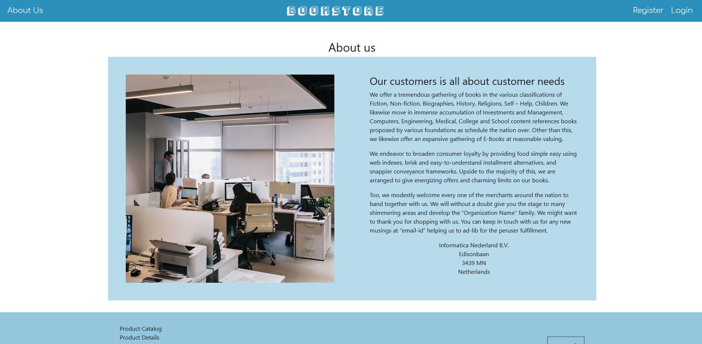
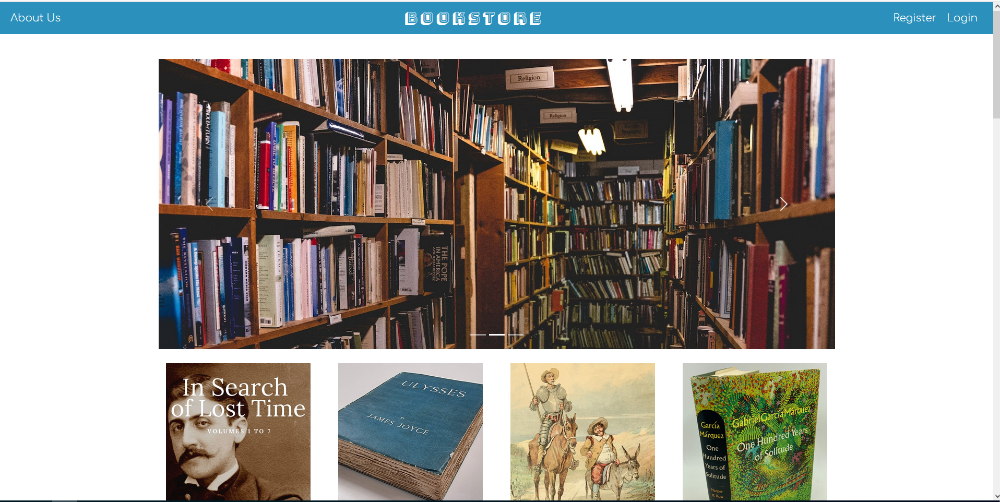
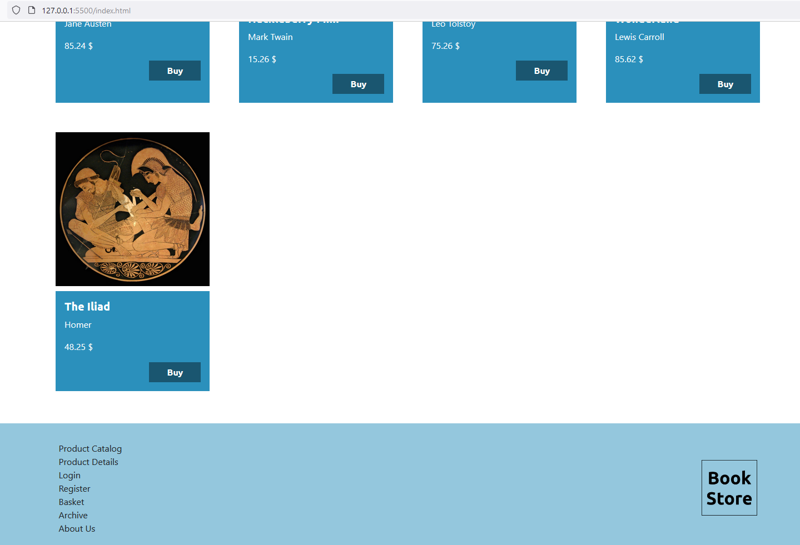
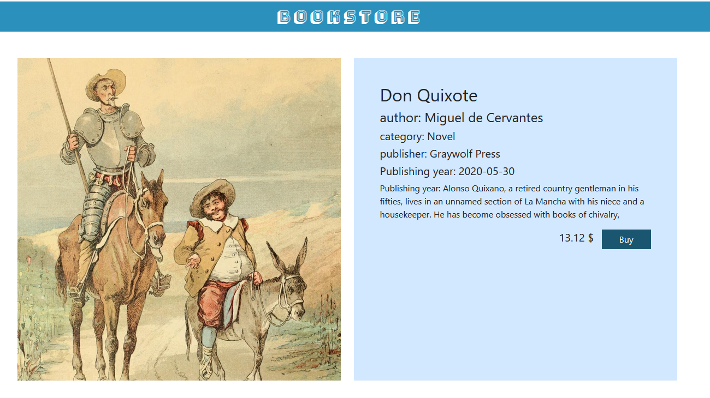
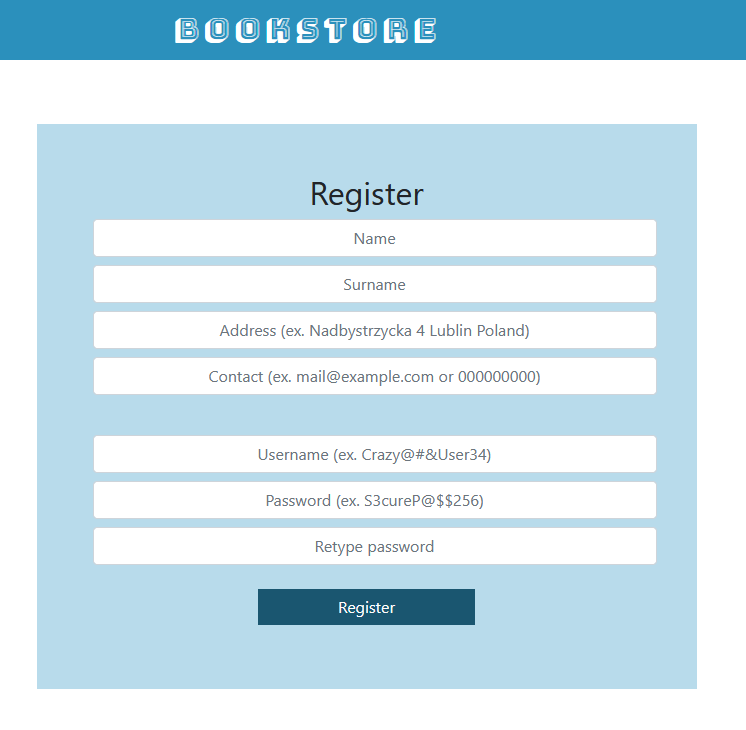
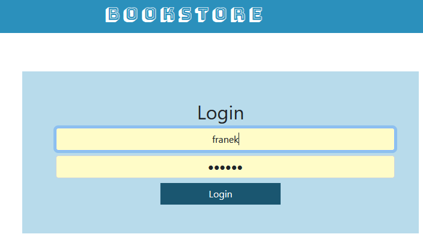
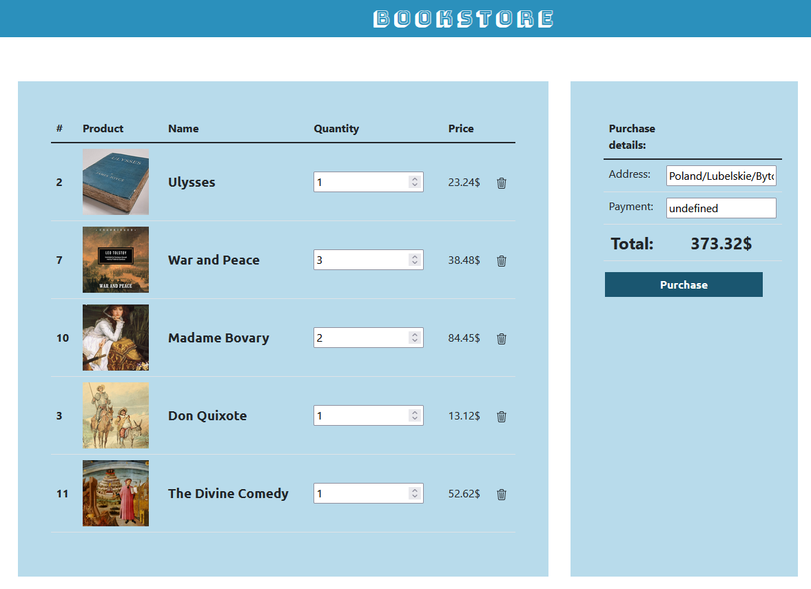
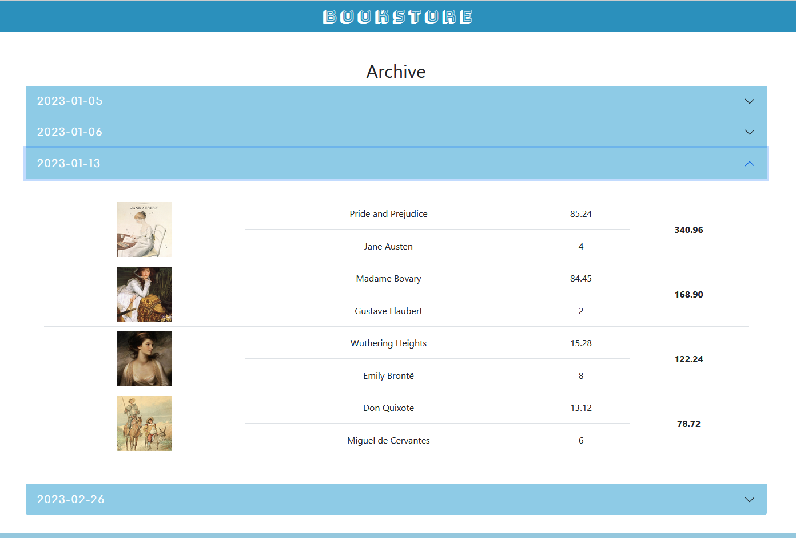

# Project description
Project is the functional implementation of web-based bookstore.
Project uses technologies such as:
- Java 19,
    - mysql connector
    - HikariCP,
    - Maven,
- HTML,
- JavaScript,
- CSS,
    - Bootstrap 5,

Project supports:
- User self-registry and account creation with integrity checking and regexp security,
- Profile data change during checkout during purchase,
- Basket modification eg. book count edit, book delete,
- Archivization after cart purchase,
- Encrypted passwords in database,
- Token-based login to account (multiple login supported), 

# Project files:

The project contains files such as:
- Database - which contains SQL script to import database structure and example data, alongside the database structure,
- store-cli-api - which contains commandline interface to database and provides set of commands to select, create, update,delete records from database,  
- spring-boot-store - which contains springboot application that creates a micro services for our frontend website to perform CRUD operations on database and provides functionality for async operations,
- store-front - website for interaction from user with bookstore system that provides possibility to search through catalog of book positions, create account or log in, adding books to purchase and finalizing buying operation alongside with archivization, 

# Project installation:
To install and check put project follow these steps:
1. Instal Xampp (start mysql server, apache server) and create database "store" and import "store.sql"
2. Open store-cli project using IntellijIdea (remember to have intslled Java SDK 19) and install it using Maven.
3. Open spring-boot-store using IntellijIdea and just run it being in file SpringBootStoreApplication
4. Open file in Visual Studio Code and using Live server start index.html (preferably)
5. Create account or use (franek, franek) or account (robert,robert) to check out functionality

# Project gallery:

## About:

## Index:

## Product:

## Register:

## Login:

## Cart:

## Archive:

